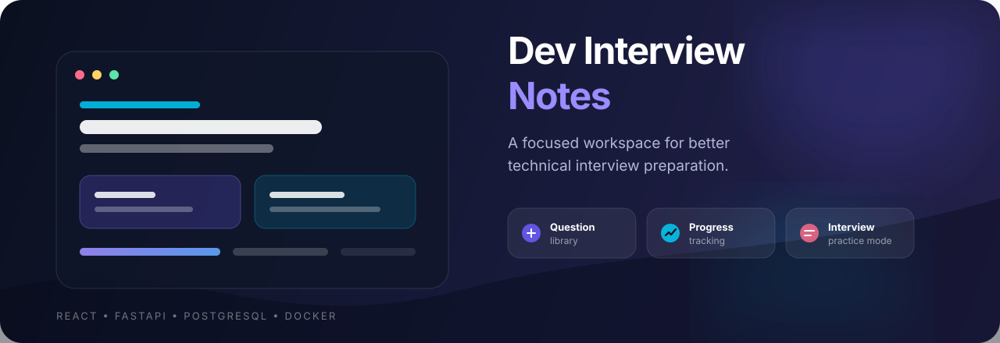
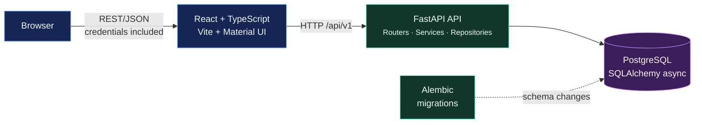
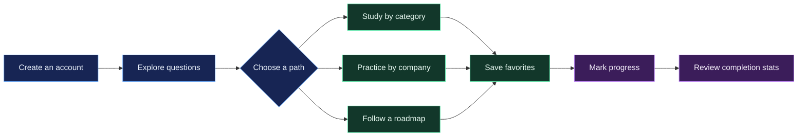

# Dev Interview Notes


<p align="center">
  
</p>

Dev Interview Notes is a full-stack interview preparation platform for organizing technical questions, studying by topic and difficulty, tracking progress, and practicing company-specific interview sets.

The project is designed as a portfolio application and demonstrates a layered backend architecture, asynchronous database access, secure cookie-based authentication, role-based access control, migrations, and a responsive React user interface.

## Highlights

- Account registration, login, logout, profile management, and password recovery.
- Access and refresh JWT tokens stored in HTTP-only cookies.
- Rate-limited authentication endpoints and failed-login lockout settings.
- Question library with categories, difficulty levels, publication status, filtering, sorting, and pagination.
- Structured question content with formatted text, code blocks, syntax highlighting, and media blocks.
- Personal favorites, completed-question tracking, and completion statistics.
- Company pages with company-specific question collections and an interview practice mode.
- Profession-oriented learning roadmaps with ordered question groups.
- Admin panel for questions, answers, categories, companies, roadmaps, and users.
- Light/dark theme support and responsive layouts built with Material UI.
- Interactive OpenAPI documentation generated by FastAPI.

## Tech stack

| Layer | Technologies |
| --- | --- |
| Frontend | React 19, TypeScript, Vite, Material UI, React Router, TanStack Query, Axios, Zod |
| Backend | Python 3.10+, FastAPI, Uvicorn, Pydantic Settings |
| Data layer | PostgreSQL 15+, SQLAlchemy 2 async ORM, asyncpg |
| Migrations | Alembic |
| Security | JWT, HTTP-only cookies, Passlib, role-based authorization |
| Delivery | Docker, Docker Compose |

## Application architecture



The backend follows a router → service → repository separation. Database schema changes are versioned with Alembic rather than being created implicitly at application startup.

## How the product works



## Repository structure

```text
.
├── app/
│   ├── core/           # Settings, authentication, authorization, middleware, logging
│   ├── db/             # Async database session and SQLAlchemy models
│   ├── repositories/   # Persistence layer
│   ├── routers/        # FastAPI route modules
│   ├── schemas/        # Pydantic request and response models
│   └── services/       # Application and domain logic
├── alembic/            # Database migration environment and revisions
├── frontend/
│   ├── src/components/ # Reusable UI and admin components
│   ├── src/pages/      # Route-level screens
│   ├── src/services/   # Typed API clients
│   └── src/context/    # Authentication and theme state
├── docs/               # Architecture, API, and development documentation
├── docker-compose.yml
├── Dockerfile
└── Dockerfile.frontend
```

## Quick start with Docker

### Prerequisites

- Docker Engine 24+ with Docker Compose
- Git

### 1. Clone and configure the project

```bash
git clone <your-repository-url>
cd dev_interview_notes
cp .env.example .env
cp frontend/.env.example frontend/.env
```

Set unique values for `SECRET_KEY` and `REFRESH_SECRET_KEY` before using the application outside a local development environment. For example:

```bash
openssl rand -hex 32
```

### 2. Start the development stack

```bash
docker compose up --build db migrations api frontend
```

The command starts PostgreSQL, applies all Alembic migrations, and launches the API and frontend.

| Service | URL |
| --- | --- |
| Frontend | <http://localhost:5173> |
| API root | <http://localhost:8888> |
| Swagger UI | <http://localhost:8888/docs> |
| ReDoc | <http://localhost:8888/redoc> |
| PostgreSQL from the host | `localhost:5454` |

The `nginx` service in `docker-compose.yml` is an optional reverse-proxy setup. It expects configuration and SSL files under `nginx/`, which are not part of the current development checkout. Start the four core services above for local development.

### 3. Useful Docker commands

```bash
# Run in the background
docker compose up -d db migrations api frontend

# Follow API logs
docker compose logs -f api

# Stop services and keep database data
docker compose down

# Stop services and remove the PostgreSQL volume
docker compose down -v
```

## Local development without Docker

### Backend

Prerequisites: Python 3.10+, Poetry, and PostgreSQL 15+.

```bash
poetry install
cp .env.example .env

# Configure DB_HOST, DB_PORT, DB_USER, DB_PASSWORD, and DB_NAME for your local PostgreSQL instance.
poetry run alembic upgrade head
poetry run uvicorn app.core.main:app --reload --host 0.0.0.0 --port 8888
```

The backend entry point is `app.core.main:app`.

### Frontend

Prerequisites: Node.js 20+ and Yarn or npm.

```bash
cd frontend
cp .env.example .env
yarn install
yarn dev
```

The frontend reads the API base URL from `VITE_API_URL`, which defaults to `http://localhost:8888/api/v1`.

## Configuration

The application loads environment variables from `.env`. A complete safe template is available in [.env.example](.env.example). The frontend template is available in [frontend/.env.example](frontend/.env.example).

Important settings include:

| Variable | Purpose | Example |
| --- | --- | --- |
| `DB_HOST` / `DB_PORT` | PostgreSQL connection | `localhost` / `5454` locally; `db` / `5432` in Compose |
| `DB_USER` / `DB_PASSWORD` / `DB_NAME` | PostgreSQL credentials and database name | `postgres` / local secret / `interview_notes` |
| `API_PREFIX` | API route prefix | `/api/v1` |
| `CORS_ORIGINS` | JSON list of allowed browser origins | `["http://localhost:5173"]` |
| `SECRET_KEY` | Access-token signing secret | generated random value |
| `REFRESH_SECRET_KEY` | Refresh-token signing secret | generated random value |
| `ENVIRONMENT` | Runtime environment | `development` or `production` |
| `DEBUG` | SQLAlchemy/FastAPI debug behavior | `True` locally, `False` in production |
| `VITE_API_URL` | Frontend API base URL | `http://localhost:8888/api/v1` |

SMTP variables are required by the current settings model. Use a local SMTP sink such as Mailpit for development, or provide real SMTP credentials when testing password recovery and feedback email delivery.

## API overview

The API is available under `/api/v1`. OpenAPI is generated automatically, so the most detailed and always-current reference is available at `/docs` after startup.

| Resource | Main capabilities |
| --- | --- |
| Authentication | Register, login, refresh, logout, current user, profile update, password recovery |
| Questions | List, filter, sort, retrieve, create, update, delete |
| Answers | List, retrieve, create, update, delete answers for a question |
| Categories | List, retrieve, create, update, delete |
| Companies | List, retrieve, question counts, company questions, admin CRUD |
| Progress | Mark/unmark questions, check state, global and category statistics |
| Favorites | Add/remove, check state, list a user's favorites |
| Roadmaps | Browse by profession, retrieve details, admin CRUD for roadmaps and items |
| Users | Admin user management and feedback submission |

See the full endpoint matrix in [docs/api.md](docs/api.md).

## Authentication and authorization

Authentication uses short-lived access JWTs and longer-lived refresh JWTs. Both tokens are set as HTTP-only cookies by the API. The frontend sends requests with credentials enabled and automatically attempts token refresh when an access token expires.

The application defines `user` and `admin` roles. Regular users can read learning content and manage their own profile, favorites, and progress. Admin-only routes manage the content catalog, companies, roadmaps, answers, and users.

## Development checks

```bash
# Backend syntax check
python -m compileall app

# Frontend lint and production build
cd frontend
yarn lint
yarn build
```

The repository currently does not include an automated backend test suite. The generated Swagger UI, health endpoint, frontend linting, and TypeScript production build are useful baseline checks during development.

## Health check

```bash
curl http://localhost:8888/health
```

The response includes application metadata and PostgreSQL connectivity status. A healthy response reports `status: "healthy"` and database information.

## Database migrations

```bash
# Apply all pending migrations
poetry run alembic upgrade head

# Show the current revision
poetry run alembic current

# Create a new revision after changing models
poetry run alembic revision --autogenerate -m "describe the schema change"
```

Read [docs/development.md](docs/development.md) for the recommended workflow and [docs/architecture.md](docs/architecture.md) for implementation details.

## Security before publishing

- Never commit `.env`, SMTP passwords, JWT secrets, or production database credentials.
- The local `.env` file is ignored by `.gitignore`, but verify that it is not already tracked before pushing to GitHub.
- If `.env` is tracked, remove it from Git tracking with `git rm --cached .env` and rotate every exposed secret.
- Replace the development JWT defaults with strong environment-provided secrets.
- Use `ENVIRONMENT=production`, `DEBUG=False`, HTTPS, restricted CORS origins, and a managed secret store for deployment.

## License

No license file is currently included. Add a license that matches your intended use before presenting the repository as an open-source project.
